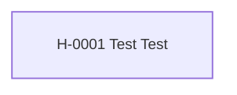

---
cssclasses:
  - kompakt-stamtavla
---

#stamtavla

**Senast uppdaterad:** 2026-07-16 *23:00*

# Fristående hästar

> [!abstract] Släktöversikt
> **Antal hästar:** 1
> **Genomsnittlig genetisk rank:** [[03. Lexikon/03.4 Genetiska ranker/D|D]] (42.2 %)
> **Genomsnittlig hälsa:** 20,0
> **Genomsnittligt hopp:** 3,0 block
> **Genomsnittlig snabbhet:** 8,7 b/s
> **Ägare:** [[02. Register/02.2 Spelare/LOWAb|LOWAb]]
> **Uppfödare:** [[02. Register/02.2 Spelare/LOWAb|LOWAb]]

Hästarna på denna sida saknar registrerade släktband till andra hästar.

## Hästar i släkten

| Häst | Ägare | Uppfödare | Rank |
|---|---|---|:---:|
| <a class="internal" href="/02.%20Register/02.1%20H%C3%A4star/H-0001%20Test%20Test">H-0001 Test Test</a> | <a class="internal" href="/02.%20Register/02.2%20Spelare/LOWAb">LOWAb</a> | <a class="internal" href="/02.%20Register/02.2%20Spelare/LOWAb">LOWAb</a> | <a class="internal" href="/03.%20Lexikon/03.4%20Genetiska%20ranker/D">D</a> |
