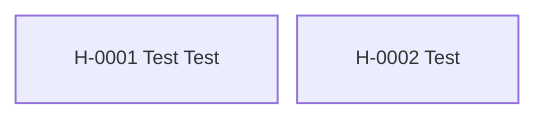

---
cssclasses:
  - kompakt-stamtavla
---

#stamtavla

**Senast uppdaterad:** 2026-07-16 *18:30*

# Fristående hästar

> [!abstract] Släktöversikt
> **Antal hästar:** 2
> **Genomsnittlig genetisk rank:** [[03. Lexikon/03.4 Genetiska ranker/D|D]] (45.9 %)
> **Genomsnittlig hälsa:** 20,5
> **Genomsnittligt hopp:** 3,2 block
> **Genomsnittlig snabbhet:** 8,8 b/s
> **Ägare:** [[02. Register/02.2 Spelare/LOWAb|LOWAb]]
> **Uppfödare:** [[02. Register/02.2 Spelare/LOWAb|LOWAb]]

Hästarna på denna sida saknar registrerade släktband till andra hästar.

## Hästar i släkten

| Häst | Ägare | Uppfödare | Rank |
|---|---|---|:---:|
| [[02. Register/02.1 Hästar/H-0001 Test Test|H-0001 Test Test]] | [[02. Register/02.2 Spelare/LOWAb|LOWAb]] | [[02. Register/02.2 Spelare/LOWAb|LOWAb]] | [[03. Lexikon/03.4 Genetiska ranker/D|D]] |
| [[02. Register/02.1 Hästar/H-0002 Test|H-0002 Test]] | [[02. Register/02.2 Spelare/LOWAb|LOWAb]] | [[02. Register/02.2 Spelare/LOWAb|LOWAb]] | [[03. Lexikon/03.4 Genetiska ranker/D|D]] |
