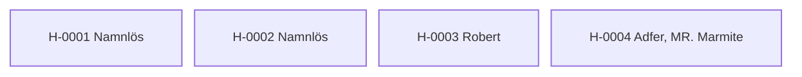

---
cssclasses:
  - kompakt-stamtavla
---

#stamtavla

**Senast uppdaterad:** 2026-07-21 *23:25*

# Fristående hästar

> [!abstract] Släktöversikt
> **Placering bland stamtavlor:** Ej rangordnad
> **Antal hästar:** 4
> **Genomsnittlig genetisk rank:** [[03. Lexikon/03.4 Genetiska ranker/F|F]] (24.9 %)
> **Genomsnittlig inavelsgrad:** 0,00 %
> **Stamtavlans genetiska anlag:** 0 förekomster · 0 typer · 0 av 4 hästar berörda
> **Genomsnittlig hälsa:** 18,2
> **Genomsnittligt hopp:** 2,0 block
> **Genomsnittlig snabbhet:** 7,2 b/s
> **Ägare:** [[02. Register/02.2 Spelare/Grisimon|Grisimon]], [[02. Register/02.2 Spelare/KlussiAreCool|KlussiAreCool]], [[02. Register/02.2 Spelare/LOWAb|LOWAb]], [[02. Register/02.2 Spelare/mmlx|mmlx]]
> **Uppfödare:** [[02. Register/02.2 Spelare/Grisimon|Grisimon]], [[02. Register/02.2 Spelare/KlussiAreCool|KlussiAreCool]], [[02. Register/02.2 Spelare/LOWAb|LOWAb]], [[02. Register/02.2 Spelare/mmlx|mmlx]]

Hästarna på denna sida saknar registrerade släktband till andra hästar.

## Genetiska anlag i stamtavlan

Inga kända genetiska riskanlag finns registrerade i stamtavlan.

## Hästar i släkten

| Häst | Ägare | Uppfödare | Rank |
|---|---|---|:---:|
| <a class="internal" href="/02.%20Register/02.1%20H%C3%A4star/H-0001%20Namnl%C3%B6s">H-0001 Namnlös</a> | <a class="internal" href="/02.%20Register/02.2%20Spelare/KlussiAreCool">KlussiAreCool</a> | <a class="internal" href="/02.%20Register/02.2%20Spelare/KlussiAreCool">KlussiAreCool</a> | <a class="internal" href="/03.%20Lexikon/03.4%20Genetiska%20ranker/F">F</a> |
| <a class="internal" href="/02.%20Register/02.1%20H%C3%A4star/H-0002%20Namnl%C3%B6s">H-0002 Namnlös</a> | <a class="internal" href="/02.%20Register/02.2%20Spelare/mmlx">mmlx</a> | <a class="internal" href="/02.%20Register/02.2%20Spelare/mmlx">mmlx</a> | <a class="internal" href="/03.%20Lexikon/03.4%20Genetiska%20ranker/F">F</a> |
| <a class="internal" href="/02.%20Register/02.1%20H%C3%A4star/H-0003%20Robert">H-0003 Robert</a> | <a class="internal" href="/02.%20Register/02.2%20Spelare/LOWAb">LOWAb</a> | <a class="internal" href="/02.%20Register/02.2%20Spelare/LOWAb">LOWAb</a> | <a class="internal" href="/03.%20Lexikon/03.4%20Genetiska%20ranker/F">F</a> |
| <a class="internal" href="/02.%20Register/02.1%20H%C3%A4star/H-0004%20Adfer%2C%20MR.%20Marmite">H-0004 Adfer, MR. Marmite</a> | <a class="internal" href="/02.%20Register/02.2%20Spelare/Grisimon">Grisimon</a> | <a class="internal" href="/02.%20Register/02.2%20Spelare/Grisimon">Grisimon</a> | <a class="internal" href="/03.%20Lexikon/03.4%20Genetiska%20ranker/D">D</a> |
