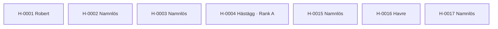

---
cssclasses:
  - kompakt-stamtavla
---

#stamtavla

**Senast uppdaterad:** 2026-07-18 *15:30*

# Fristående hästar

> [!abstract] Släktöversikt
> **Placering bland stamtavlor:** Ej rangordnad
> **Antal hästar:** 7
> **Genomsnittlig genetisk rank:** [[03. Lexikon/03.4 Genetiska ranker/C|C]] (59.5 %)
> **Genomsnittlig inavelsgrad:** 0,00 %
> **Stamtavlans genetiska anlag:** 0 förekomster · 0 typer · 0 av 7 hästar berörda
> **Genomsnittlig hälsa:** 23,9
> **Genomsnittligt hopp:** 3,4 block
> **Genomsnittlig snabbhet:** 10,3 b/s
> **Ägare:** [[02. Register/02.2 Spelare/LOWAb|LOWAb]]
> **Uppfödare:** [[02. Register/02.2 Spelare/LOWAb|LOWAb]]

Hästarna på denna sida saknar registrerade släktband till andra hästar.

## Genetiska anlag i stamtavlan

Inga kända genetiska riskanlag finns registrerade i stamtavlan.

## Hästar i släkten

| Häst | Ägare | Uppfödare | Rank |
|---|---|---|:---:|
| <a class="internal" href="/02.%20Register/02.1%20H%C3%A4star/H-0001%20Robert">H-0001 Robert</a> | <a class="internal" href="/02.%20Register/02.2%20Spelare/LOWAb">LOWAb</a> | <a class="internal" href="/02.%20Register/02.2%20Spelare/LOWAb">LOWAb</a> | <a class="internal" href="/03.%20Lexikon/03.4%20Genetiska%20ranker/E">E</a> |
| <a class="internal" href="/02.%20Register/02.1%20H%C3%A4star/H-0002%20Namnl%C3%B6s">H-0002 Namnlös</a> | <a class="internal" href="/02.%20Register/02.2%20Spelare/LOWAb">LOWAb</a> | <a class="internal" href="/02.%20Register/02.2%20Spelare/LOWAb">LOWAb</a> | <a class="internal" href="/03.%20Lexikon/03.4%20Genetiska%20ranker/C">C</a> |
| <a class="internal" href="/02.%20Register/02.1%20H%C3%A4star/H-0003%20Namnl%C3%B6s">H-0003 Namnlös</a> | <a class="internal" href="/02.%20Register/02.2%20Spelare/LOWAb">LOWAb</a> | <a class="internal" href="/02.%20Register/02.2%20Spelare/LOWAb">LOWAb</a> | <a class="internal" href="/03.%20Lexikon/03.4%20Genetiska%20ranker/B">B</a> |
| <a class="internal" href="/02.%20Register/02.1%20H%C3%A4star/H-0004%20H%C3%A4st%C3%A4gg%20%C2%B7%20Rank%20A">H-0004 Hästägg · Rank A</a> | <a class="internal" href="/02.%20Register/02.2%20Spelare/LOWAb">LOWAb</a> | <a class="internal" href="/02.%20Register/02.2%20Spelare/LOWAb">LOWAb</a> | <a class="internal" href="/03.%20Lexikon/03.4%20Genetiska%20ranker/A">A</a> |
| <a class="internal" href="/02.%20Register/02.1%20H%C3%A4star/H-0015%20Namnl%C3%B6s">H-0015 Namnlös</a> | <a class="internal" href="/02.%20Register/02.2%20Spelare/LOWAb">LOWAb</a> | <a class="internal" href="/02.%20Register/02.2%20Spelare/LOWAb">LOWAb</a> | <a class="internal" href="/03.%20Lexikon/03.4%20Genetiska%20ranker/D">D</a> |
| <a class="internal" href="/02.%20Register/02.1%20H%C3%A4star/H-0016%20Havre">H-0016 Havre</a> | <a class="internal" href="/02.%20Register/02.2%20Spelare/LOWAb">LOWAb</a> | <a class="internal" href="/02.%20Register/02.2%20Spelare/LOWAb">LOWAb</a> | <a class="internal" href="/03.%20Lexikon/03.4%20Genetiska%20ranker/C">C</a> |
| <a class="internal" href="/02.%20Register/02.1%20H%C3%A4star/H-0017%20Namnl%C3%B6s">H-0017 Namnlös</a> | <a class="internal" href="/02.%20Register/02.2%20Spelare/LOWAb">LOWAb</a> | <a class="internal" href="/02.%20Register/02.2%20Spelare/LOWAb">LOWAb</a> | <a class="internal" href="/03.%20Lexikon/03.4%20Genetiska%20ranker/D">D</a> |
