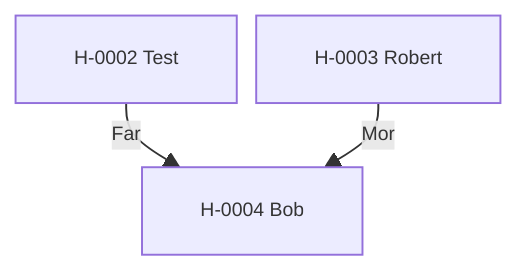

---
cssclasses:
  - kompakt-stamtavla
---

#stamtavla

**Senast uppdaterad:** 2026-07-16 *22:33*

# Stamtavla H-0002

> [!abstract] Släktöversikt
> **Antal hästar:** 3
> **Genomsnittlig genetisk rank:** [[03. Lexikon/03.4 Genetiska ranker/D|D]] (49.6 %)
> **Genomsnittlig hälsa:** 20,5
> **Genomsnittligt hopp:** 3,9 block
> **Genomsnittlig snabbhet:** 8,5 b/s
> **Ägare:** [[02. Register/02.2 Spelare/LOWAb|LOWAb]]
> **Uppfödare:** [[02. Register/02.2 Spelare/LOWAb|LOWAb]]

Klicka på en häst i diagrammet för att öppna profilen.

## Hästar i släkten

| Häst | Ägare | Uppfödare | Rank |
|---|---|---|:---:|
| [[02. Register/02.1 Hästar/H-0002 Test|H-0002 Test]] | [[02. Register/02.2 Spelare/LOWAb|LOWAb]] | [[02. Register/02.2 Spelare/LOWAb|LOWAb]] | [[03. Lexikon/03.4 Genetiska ranker/D|D]] |
| [[02. Register/02.1 Hästar/H-0003 Robert|H-0003 Robert]] | [[02. Register/02.2 Spelare/LOWAb|LOWAb]] | [[02. Register/02.2 Spelare/LOWAb|LOWAb]] | [[03. Lexikon/03.4 Genetiska ranker/E|E]] |
| [[02. Register/02.1 Hästar/H-0004 Bob|H-0004 Bob]] | [[02. Register/02.2 Spelare/LOWAb|LOWAb]] | [[02. Register/02.2 Spelare/LOWAb|LOWAb]] | [[03. Lexikon/03.4 Genetiska ranker/C|C]] |
