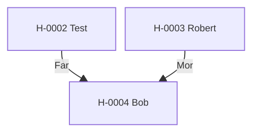

---
cssclasses:
  - kompakt-stamtavla
---

#stamtavla

**Senast uppdaterad:** 2026-07-16 *23:00*

# Stamtavla H-0002

> [!abstract] Släktöversikt
> **Antal hästar:** 3
> **Genomsnittlig genetisk rank:** [[03. Lexikon/03.4 Genetiska ranker/D|D]] (49.6 %)
> **Genomsnittlig hälsa:** 20,5
> **Genomsnittligt hopp:** 3,9 block
> **Genomsnittlig snabbhet:** 8,5 b/s
> **Ägare:** [[02. Register/02.2 Spelare/LOWAb|LOWAb]]
> **Uppfödare:** [[02. Register/02.2 Spelare/LOWAb|LOWAb]]

Klicka på en häst i diagrammet för att öppna profilen.

## Hästar i släkten

| Häst | Ägare | Uppfödare | Rank |
|---|---|---|:---:|
| <a class="internal" href="/02.%20Register/02.1%20H%C3%A4star/H-0002%20Test">H-0002 Test</a> | <a class="internal" href="/02.%20Register/02.2%20Spelare/LOWAb">LOWAb</a> | <a class="internal" href="/02.%20Register/02.2%20Spelare/LOWAb">LOWAb</a> | <a class="internal" href="/03.%20Lexikon/03.4%20Genetiska%20ranker/D">D</a> |
| <a class="internal" href="/02.%20Register/02.1%20H%C3%A4star/H-0003%20Robert">H-0003 Robert</a> | <a class="internal" href="/02.%20Register/02.2%20Spelare/LOWAb">LOWAb</a> | <a class="internal" href="/02.%20Register/02.2%20Spelare/LOWAb">LOWAb</a> | <a class="internal" href="/03.%20Lexikon/03.4%20Genetiska%20ranker/E">E</a> |
| <a class="internal" href="/02.%20Register/02.1%20H%C3%A4star/H-0004%20Bob">H-0004 Bob</a> | <a class="internal" href="/02.%20Register/02.2%20Spelare/LOWAb">LOWAb</a> | <a class="internal" href="/02.%20Register/02.2%20Spelare/LOWAb">LOWAb</a> | <a class="internal" href="/03.%20Lexikon/03.4%20Genetiska%20ranker/C">C</a> |
