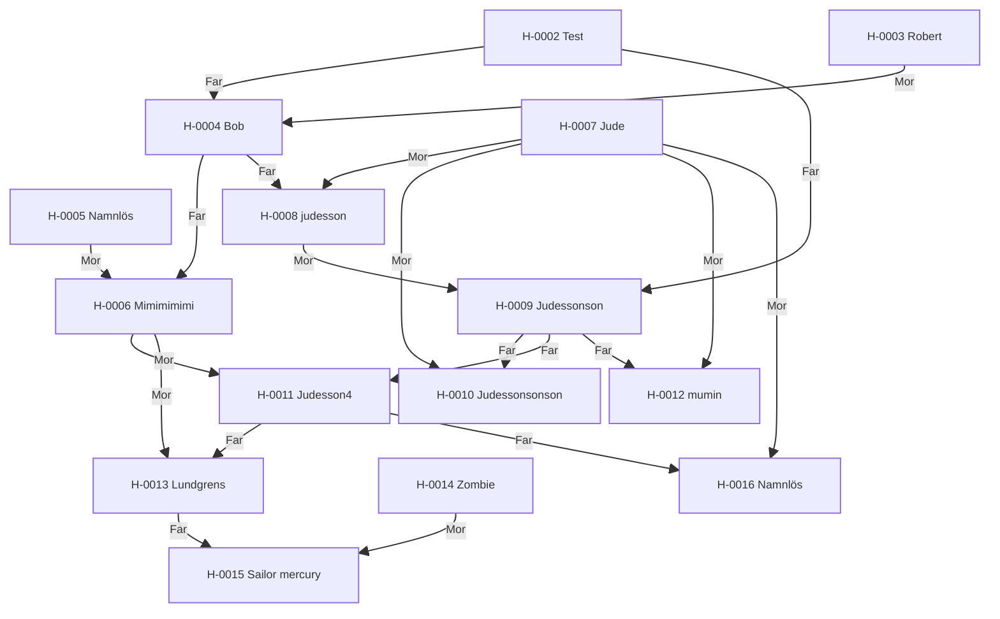

---
cssclasses:
  - kompakt-stamtavla
---

#stamtavla

**Senast uppdaterad:** 2026-07-17 *01:40*

# Stamtavla H-0002

> [!abstract] Släktöversikt
> **Antal hästar:** 15
> **Genomsnittlig genetisk rank:** [[03. Lexikon/03.4 Genetiska ranker/D|D]] (53.5 %)
> **Genomsnittlig hälsa:** 20,9
> **Genomsnittligt hopp:** 3,6 block
> **Genomsnittlig snabbhet:** 10,0 b/s
> **Ägare:** [[02. Register/02.2 Spelare/LOWAb|LOWAb]], [[02. Register/02.2 Spelare/Satm4ra|Satm4ra]]
> **Uppfödare:** [[02. Register/02.2 Spelare/LOWAb|LOWAb]], [[02. Register/02.2 Spelare/Satm4ra|Satm4ra]]

Klicka på en häst i diagrammet för att öppna profilen.

## Hästar i släkten

| Häst | Ägare | Uppfödare | Rank |
|---|---|---|:---:|
| <a class="internal" href="/02.%20Register/02.1%20H%C3%A4star/H-0002%20Test">H-0002 Test</a> | <a class="internal" href="/02.%20Register/02.2%20Spelare/LOWAb">LOWAb</a> | <a class="internal" href="/02.%20Register/02.2%20Spelare/LOWAb">LOWAb</a> | <a class="internal" href="/03.%20Lexikon/03.4%20Genetiska%20ranker/D">D</a> |
| <a class="internal" href="/02.%20Register/02.1%20H%C3%A4star/H-0003%20Robert">H-0003 Robert</a> | <a class="internal" href="/02.%20Register/02.2%20Spelare/LOWAb">LOWAb</a> | <a class="internal" href="/02.%20Register/02.2%20Spelare/LOWAb">LOWAb</a> | <a class="internal" href="/03.%20Lexikon/03.4%20Genetiska%20ranker/E">E</a> |
| <a class="internal" href="/02.%20Register/02.1%20H%C3%A4star/H-0004%20Bob">H-0004 Bob</a> | <a class="internal" href="/02.%20Register/02.2%20Spelare/LOWAb">LOWAb</a> | <a class="internal" href="/02.%20Register/02.2%20Spelare/LOWAb">LOWAb</a> | <a class="internal" href="/03.%20Lexikon/03.4%20Genetiska%20ranker/C">C</a> |
| <a class="internal" href="/02.%20Register/02.1%20H%C3%A4star/H-0005%20Namnl%C3%B6s">H-0005 Namnlös</a> | <a class="internal" href="/02.%20Register/02.2%20Spelare/LOWAb">LOWAb</a> | <a class="internal" href="/02.%20Register/02.2%20Spelare/LOWAb">LOWAb</a> | <a class="internal" href="/03.%20Lexikon/03.4%20Genetiska%20ranker/C">C</a> |
| <a class="internal" href="/02.%20Register/02.1%20H%C3%A4star/H-0006%20Mimimimimi">H-0006 Mimimimimi</a> | <a class="internal" href="/02.%20Register/02.2%20Spelare/LOWAb">LOWAb</a> | <a class="internal" href="/02.%20Register/02.2%20Spelare/LOWAb">LOWAb</a> | <a class="internal" href="/03.%20Lexikon/03.4%20Genetiska%20ranker/C">C</a> |
| <a class="internal" href="/02.%20Register/02.1%20H%C3%A4star/H-0007%20Jude">H-0007 Jude</a> | <a class="internal" href="/02.%20Register/02.2%20Spelare/Satm4ra">Satm4ra</a> | <a class="internal" href="/02.%20Register/02.2%20Spelare/Satm4ra">Satm4ra</a> | <a class="internal" href="/03.%20Lexikon/03.4%20Genetiska%20ranker/E">E</a> |
| <a class="internal" href="/02.%20Register/02.1%20H%C3%A4star/H-0008%20judesson">H-0008 judesson</a> | <a class="internal" href="/02.%20Register/02.2%20Spelare/Satm4ra">Satm4ra</a> | <a class="internal" href="/02.%20Register/02.2%20Spelare/Satm4ra">Satm4ra</a> | <a class="internal" href="/03.%20Lexikon/03.4%20Genetiska%20ranker/D">D</a> |
| <a class="internal" href="/02.%20Register/02.1%20H%C3%A4star/H-0009%20Judessonson">H-0009 Judessonson</a> | <a class="internal" href="/02.%20Register/02.2%20Spelare/Satm4ra">Satm4ra</a> | <a class="internal" href="/02.%20Register/02.2%20Spelare/Satm4ra">Satm4ra</a> | <a class="internal" href="/03.%20Lexikon/03.4%20Genetiska%20ranker/D">D</a> |
| <a class="internal" href="/02.%20Register/02.1%20H%C3%A4star/H-0010%20Judessonsonson">H-0010 Judessonsonson</a> | <a class="internal" href="/02.%20Register/02.2%20Spelare/Satm4ra">Satm4ra</a> | <a class="internal" href="/02.%20Register/02.2%20Spelare/Satm4ra">Satm4ra</a> | <a class="internal" href="/03.%20Lexikon/03.4%20Genetiska%20ranker/E">E</a> |
| <a class="internal" href="/02.%20Register/02.1%20H%C3%A4star/H-0011%20Judesson4">H-0011 Judesson4</a> | <a class="internal" href="/02.%20Register/02.2%20Spelare/Satm4ra">Satm4ra</a> | <a class="internal" href="/02.%20Register/02.2%20Spelare/Satm4ra">Satm4ra</a> | <a class="internal" href="/03.%20Lexikon/03.4%20Genetiska%20ranker/C">C</a> |
| <a class="internal" href="/02.%20Register/02.1%20H%C3%A4star/H-0012%20mumin">H-0012 mumin</a> | <a class="internal" href="/02.%20Register/02.2%20Spelare/Satm4ra">Satm4ra</a> | <a class="internal" href="/02.%20Register/02.2%20Spelare/Satm4ra">Satm4ra</a> | <a class="internal" href="/03.%20Lexikon/03.4%20Genetiska%20ranker/D">D</a> |
| <a class="internal" href="/02.%20Register/02.1%20H%C3%A4star/H-0013%20Lundgrens">H-0013 Lundgrens</a> | <a class="internal" href="/02.%20Register/02.2%20Spelare/Satm4ra">Satm4ra</a> | <a class="internal" href="/02.%20Register/02.2%20Spelare/Satm4ra">Satm4ra</a> | <a class="internal" href="/03.%20Lexikon/03.4%20Genetiska%20ranker/B">B</a> |
| <a class="internal" href="/02.%20Register/02.1%20H%C3%A4star/H-0014%20Zombie">H-0014 Zombie</a> | <a class="internal" href="/02.%20Register/02.2%20Spelare/LOWAb">LOWAb</a> | <a class="internal" href="/02.%20Register/02.2%20Spelare/LOWAb">LOWAb</a> | <a class="internal" href="/03.%20Lexikon/03.4%20Genetiska%20ranker/C">C</a> |
| <a class="internal" href="/02.%20Register/02.1%20H%C3%A4star/H-0015%20Sailor%20mercury">H-0015 Sailor mercury</a> | <a class="internal" href="/02.%20Register/02.2%20Spelare/Satm4ra">Satm4ra</a> | <a class="internal" href="/02.%20Register/02.2%20Spelare/Satm4ra">Satm4ra</a> | <a class="internal" href="/03.%20Lexikon/03.4%20Genetiska%20ranker/B">B</a> |
| <a class="internal" href="/02.%20Register/02.1%20H%C3%A4star/H-0016%20Namnl%C3%B6s">H-0016 Namnlös</a> | <a class="internal" href="/02.%20Register/02.2%20Spelare/Satm4ra">Satm4ra</a> | <a class="internal" href="/02.%20Register/02.2%20Spelare/Satm4ra">Satm4ra</a> | <a class="internal" href="/03.%20Lexikon/03.4%20Genetiska%20ranker/D">D</a> |
