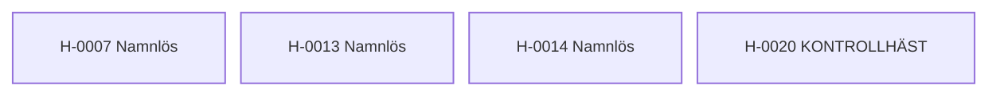

---
cssclasses:
  - kompakt-stamtavla
---

#stamtavla

**Senast uppdaterad:** 2026-07-15 *20:50*

# Fristående hästar

> [!abstract] Släktöversikt
> **Antal hästar:** 4
> **Genomsnittlig genetisk rank:** [[Genetiska ranker/D|D]] (45.2 %)
> **Genomsnittlig hälsa:** 21,2
> **Genomsnittligt hopp:** 2,7 block
> **Genomsnittlig snabbhet:** 9,4 b/s
> **Ägare:** [[Spelare/LOWAb|LOWAb]], [[Spelare/mmlx|mmlx]]
> **Uppfödare:** [[Spelare/LOWAb|LOWAb]]

Hästarna på denna sida saknar registrerade släktband till andra hästar.

## Hästar i släkten

| Häst | Ägare | Uppfödare | Rank |
|---|---|---|:---:|
| [[Hästar/H-0007 Namnlös|H-0007 Namnlös]] | [[Spelare/mmlx|mmlx]] | [[Spelare/LOWAb|LOWAb]] | [[Genetiska ranker/C|C]] |
| [[Hästar/H-0013 Namnlös|H-0013 Namnlös]] | [[Spelare/LOWAb|LOWAb]] | [[Spelare/LOWAb|LOWAb]] | [[Genetiska ranker/E|E]] |
| [[Hästar/H-0014 Namnlös|H-0014 Namnlös]] | [[Spelare/LOWAb|LOWAb]] | [[Spelare/LOWAb|LOWAb]] | [[Genetiska ranker/D|D]] |
| [[Hästar/H-0020 KONTROLLHÄST|H-0020 KONTROLLHÄST]] | [[Spelare/LOWAb|LOWAb]] | [[Spelare/LOWAb|LOWAb]] | [[Genetiska ranker/E|E]] |

> [!info] Storlek och zoom
> Diagrammet växer automatiskt när fler hästar kopplas till släkten. På webben kan besökaren använda webbläsarens zoom (Ctrl/Cmd + och −). Diagrammets avstånd och textstorlek komprimeras automatiskt för större släkter.
