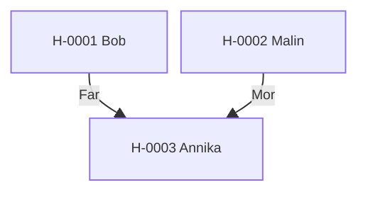

---
cssclasses:
  - kompakt-stamtavla
---

#stamtavla

**Senast uppdaterad:** 2026-07-15 *20:39*

# Stamtavla H-0001

> [!abstract] Släktöversikt
> **Antal hästar:** 3
> **Genomsnittlig genetisk rank:** [[Genetiska ranker/D|D]] (47.5 %)
> **Genomsnittlig hälsa:** 20,1
> **Genomsnittligt hopp:** 3,5 block
> **Genomsnittlig snabbhet:** 9,0 b/s
> **Ägare:** [[Spelare/Chimchom|Chimchom]], [[Spelare/LOWAb|LOWAb]]
> **Uppfödare:** [[Spelare/Chimchom|Chimchom]], [[Spelare/LOWAb|LOWAb]]

Klicka på en häst i diagrammet för att öppna profilen.

## Hästar i släkten

| Häst | Ägare | Uppfödare | Rank |
|---|---|---|:---:|
| [[Hästar/H-0001 Bob|H-0001 Bob]] | [[Spelare/Chimchom|Chimchom]] | [[Spelare/LOWAb|LOWAb]] | [[Genetiska ranker/D|D]] |
| [[Hästar/H-0002 Malin|H-0002 Malin]] | [[Spelare/LOWAb|LOWAb]] | [[Spelare/LOWAb|LOWAb]] | [[Genetiska ranker/E|E]] |
| [[Hästar/H-0003 Annika|H-0003 Annika]] | [[Spelare/LOWAb|LOWAb]] | [[Spelare/Chimchom|Chimchom]] | [[Genetiska ranker/D|D]] |

> [!info] Storlek och zoom
> Diagrammet växer automatiskt när fler hästar kopplas till släkten. På webben kan besökaren använda webbläsarens zoom (Ctrl/Cmd + och −). Diagrammets avstånd och textstorlek komprimeras automatiskt för större släkter.
