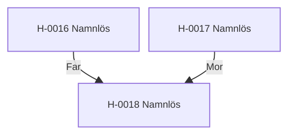

---
cssclasses:
  - kompakt-stamtavla
---

#stamtavla

**Senast uppdaterad:** 2026-07-15 *21:10*

# Stamtavla H-0016

> [!abstract] Släktöversikt
> **Antal hästar:** 3
> **Genomsnittlig genetisk rank:** [[Genetiska ranker/C|C]] (62.9 %)
> **Genomsnittlig hälsa:** 23,9
> **Genomsnittligt hopp:** 4,0 block
> **Genomsnittlig snabbhet:** 9,9 b/s
> **Ägare:** [[Spelare/LOWAb|LOWAb]]
> **Uppfödare:** [[Spelare/LOWAb|LOWAb]]

Klicka på en häst i diagrammet för att öppna profilen.

## Hästar i släkten

| Häst | Ägare | Uppfödare | Rank |
|---|---|---|:---:|
| [[Hästar/H-0016 Namnlös|H-0016 Namnlös]] | [[Spelare/LOWAb|LOWAb]] | [[Spelare/LOWAb|LOWAb]] | [[Genetiska ranker/C|C]] |
| [[Hästar/H-0017 Namnlös|H-0017 Namnlös]] | [[Spelare/LOWAb|LOWAb]] | [[Spelare/LOWAb|LOWAb]] | [[Genetiska ranker/C|C]] |
| [[Hästar/H-0018 Namnlös|H-0018 Namnlös]] | [[Spelare/LOWAb|LOWAb]] | [[Spelare/LOWAb|LOWAb]] | [[Genetiska ranker/B|B]] |

> [!info] Storlek och zoom
> Diagrammet växer automatiskt när fler hästar kopplas till släkten. På webben kan besökaren använda webbläsarens zoom (Ctrl/Cmd + och −). Diagrammets avstånd och textstorlek komprimeras automatiskt för större släkter.
